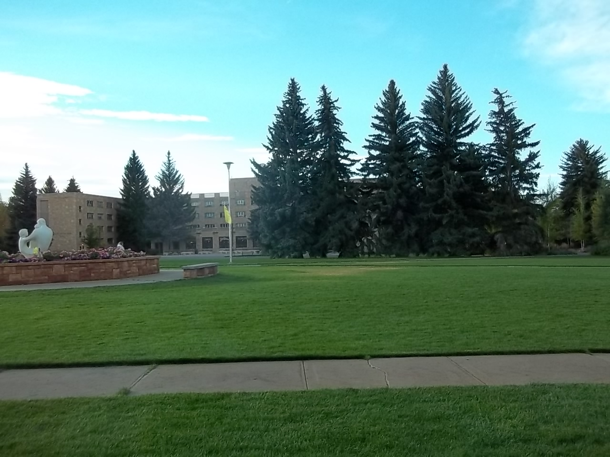
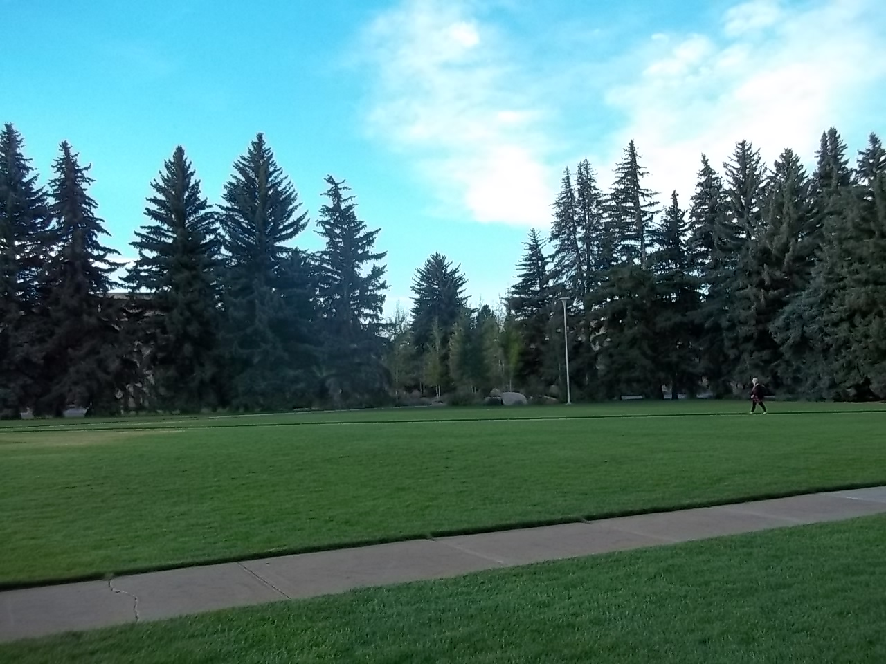
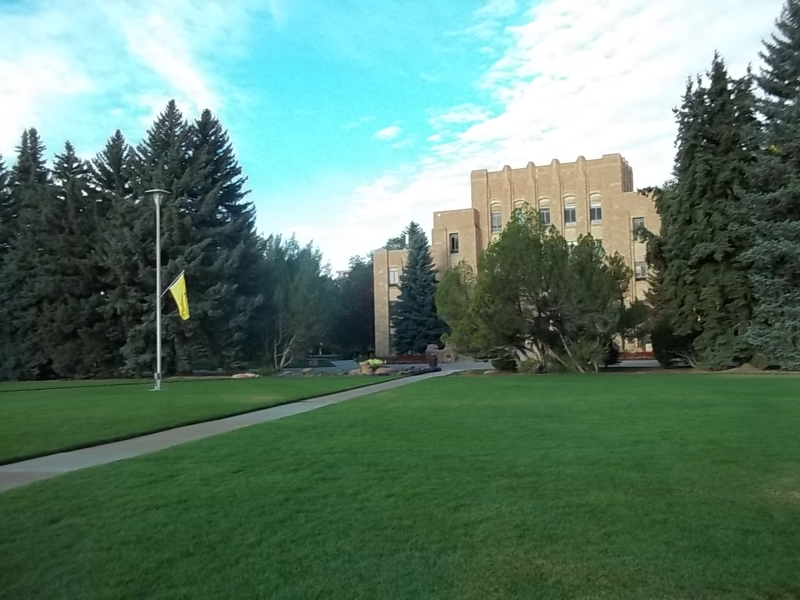
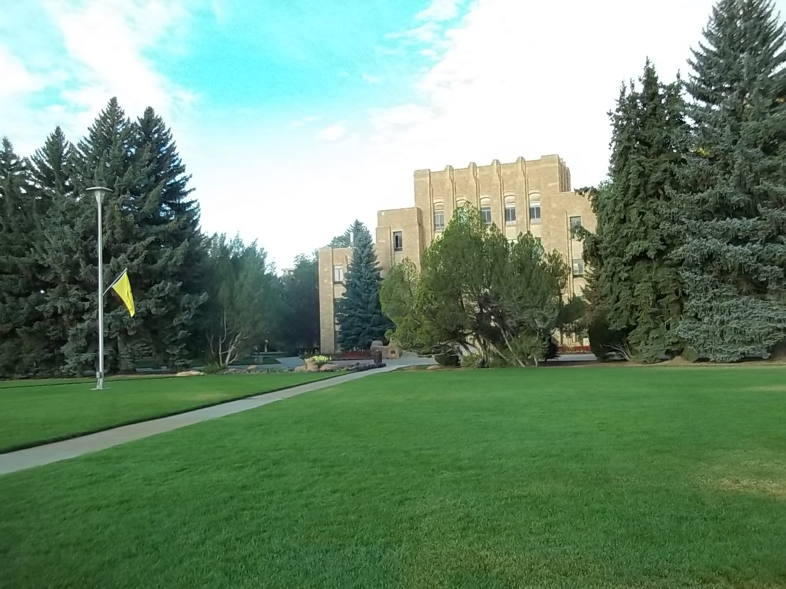
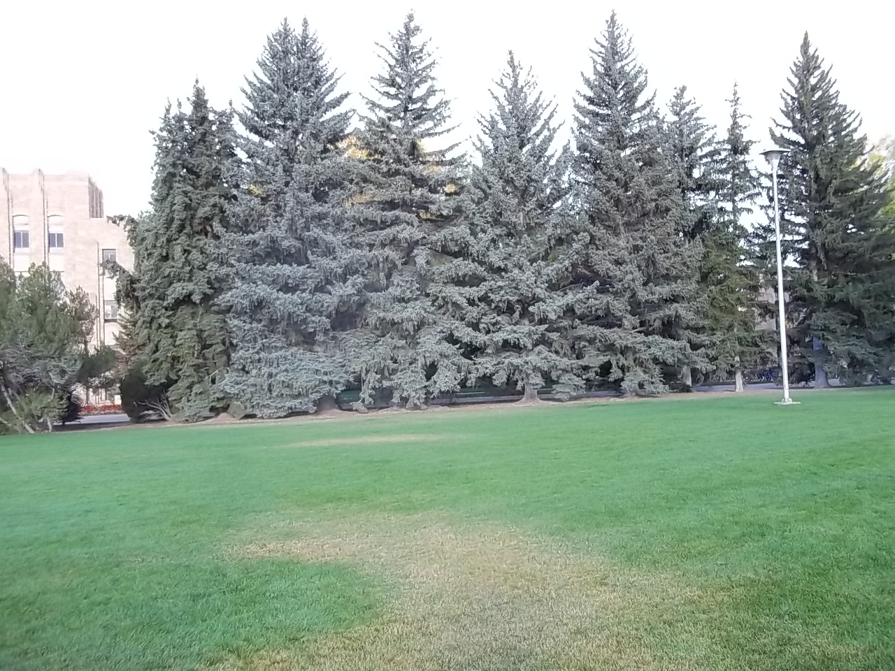
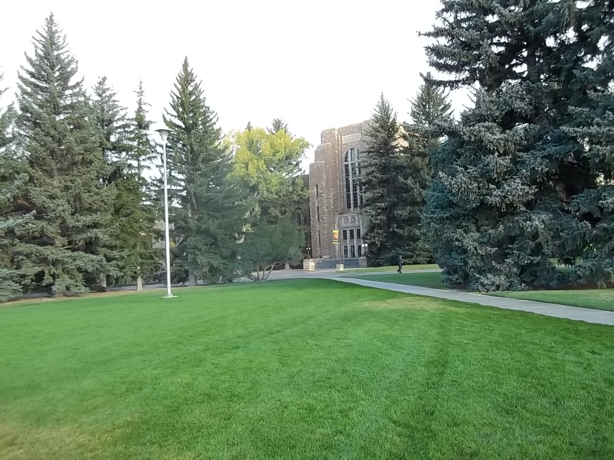
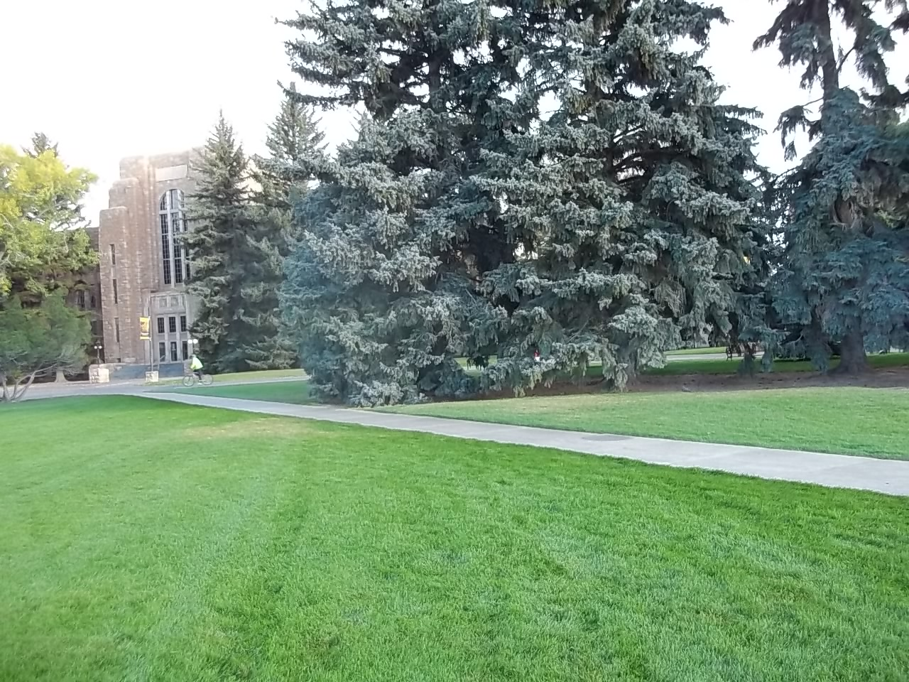

# Project 1: Camera Calibration Using Pure Rotation

## Description

This project is to calibrate a camera by using  a sequence of images that are taken as the camera rotates without translating. A number of files to help with this task are provided in WyoCourses under the directory `project1`. First, it contains seven photos taken in Prexy's pasture as I rotated the  camera. Second, it contains correspondence points for each adjoining set of images that  are contained MATLAB using `load pureRotPrexyCorrespondencePoints`. It contains two data structures, `x1pMat` and `x2pMat`. These $3 \times 100 \times 6$ data structures contain the correspondence points between images $I$ and $I + 1$. For instance, `x1pMat(:,:,1)` contains image $1$ pixel correspondence points between images $1$ and images $2$, `x2pMat(:,:,1)` contains image 2 pixel correspondence points between photos 1 and 2, `x2pMat(:,:,6)` contains image 2 pixel correspondence points between image 6 and image 7, etc. Note: These correspondence points were automatically generated using the SIFT operator, which we will soon cover. MATLAB code for SIFT is available through VLFEAT. VLFEAT is not needed for this project, but is very useful. Your task is to implement and test   the calibration algorithm that uses images obtained under pure rotation. The program `Proj1PureRotCalib5DsearchTemplate.m` is provided to help you load and plot the images, etc., so be sure to first load all the `project1` files into a single directory for you to work on., run this template, and look at its comments. It has several hints. A similar Python file, `proj1template.py` is also provided if you prefer to use Python. To do the optimization, you may find `fminsearch.m` useful in MATLAB, or `scipy.optimize.minimize` useful in Python.

1. Using the data provided, calibrate the camera. Make sure you use all six pairs of images to find a single calibration matrix that is common to all of them.
2. Estimate the rotation matrix between camera positions 2 and 3.
3. Evaluate how well your algorithm performs by plotting the reprojections of the data for images 2 and 3 along with the actual data. Comment on and try to explain any good or bad performance.
4. Extensively test your  algorithm. You may want to produce simulated points with varying noise levels, use other correspondence points in the images, calibrate your own camera, etc.
5. Throughly document your algorithm, its performance, and  the results of your tests.

## Grading Scheme

High grades are given for keen observations, creative algorithm improvements, clear documentation, etc. Show me that you understand how to implement the algorithm, what its strengths and weaknesses are, ways to mitigate any problems, etc. A formal written report documenting the above is expected and will be graded for grammar and clearness of exposition.

## Images

